# SimpleSoccer: Superfast self-play RL environment

This repository contains a simple soccer environment intended for reinforcement learning (RL) research.
The environment can be run entirely on GPU, and achieves millions of steps per second on a single device.

It can be used as a single-agent environment using a fixed policy for the opponent team, or as a multi-agent environment for self-play RL.
 
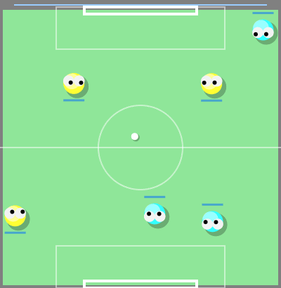 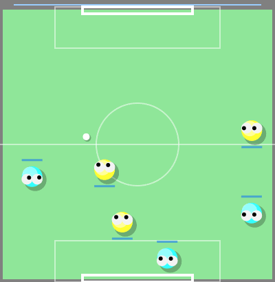 

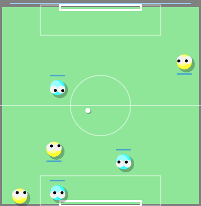  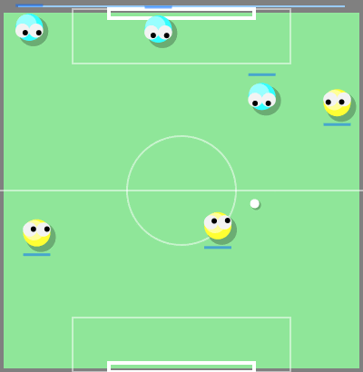 

The environment is kept as simple as possible, and does not contain engineered feature transformations or shaped rewards.
Observations consists of object coordinates and velocities, making the environment fully observed.

Visual observations or 1D-LIDAR have not been implemented yet. 

## Features
- Fast batched simulation, for fast RL loops entirely on GPU
- Suitable for both single-agent RL and self-play / league training
- Number of players per side can be changed

## Action space
*Move*:  
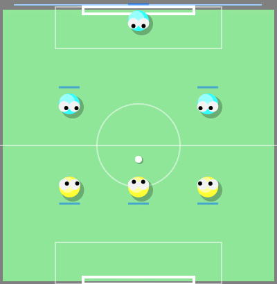

*Dash*:  
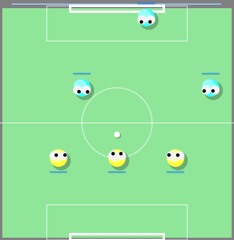

*Kick*:  
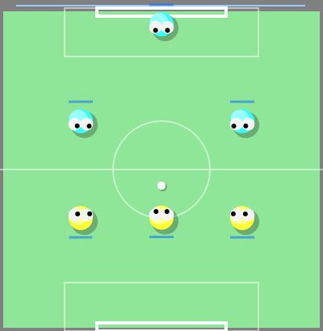

Players of each team can take independent actions.
Each player's action consists of the following discrete components:
- Movement direction: 
  - [0-7] 8 discrete angles
  - 8: no movement
- Dash:
  - 0: no dashing: recover energy
  - 1: dash: deplete energy
- Kick: 
  - 0: no kick
  - 1: soft kick
  - 2: strong kick

The action space is therefore an instance of `MultiDiscrete`.

## Performance analysis
This experiment (found in `examples/profile_env.py`) shows the batch scaling performance of the environment on a single NVIDIA A100 GPU.
Until batch sizes of more than 10k, the number of steps per second increases roughly linearly
with the batch size, indicating that the parallelization is "free" up to that point.
At batch sizes of >100k, more than 10M steps per second are reached.
Note that this analysis does not include agent inference (i.e. querying a neural network). 
Depending on the implementation, the full RL loop can still achieve several millions of steps per second.  
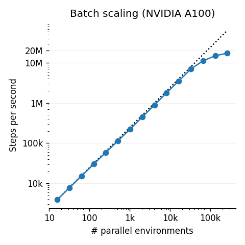

## RL training
For strong RL training performance, it is important to make sure that the actions and observations stay on the GPU after stepping the environment and training the agent.
Some RL frameworks do not support this natively, but can typically easily be tweaked to avoid forcing the relevant tensors to the CPU.
The following is a training curve of an A2C agent against the policy `HandcraftedPolicy` (in `simplesoccer.policies.handcrafted_policy`), 
trained using stable-baselines3 with the aforementioned tweak.  
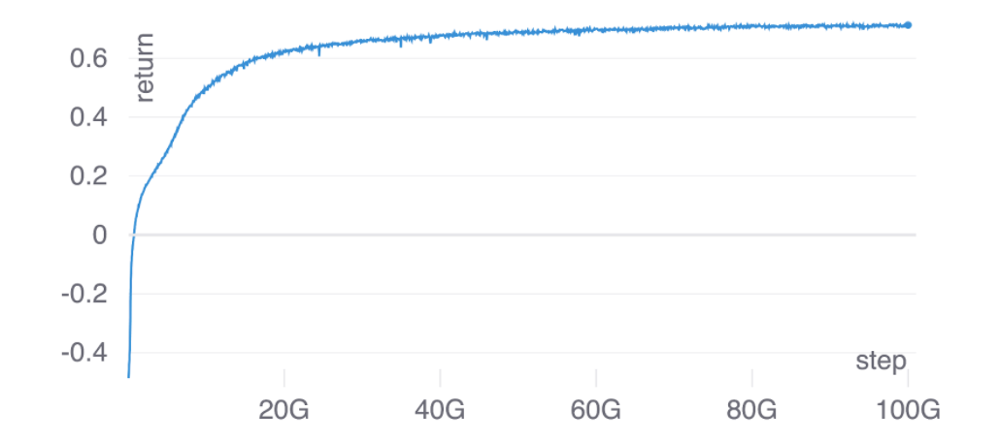

### Discount factor
The discount factor has an important influence on the types of behaviors one observes.
Here we visualize trained policies with discount factors of 0.995 and 1.0, respectively.  
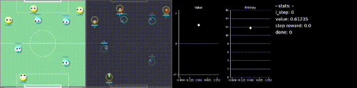

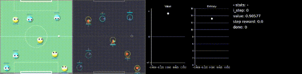

## Acknowledgments
I thank Giambattista Parascandolo and Lenz Belzner for their helpful feedback! 
